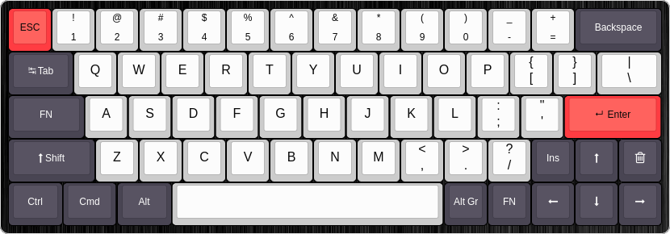

* Designed for use with US International (with AltGR dead keys) OS input layout
* test: `xev | awk -F'[ )]+' '/^KeyPress/ { a[NR+2] } NR in a { printf "%-3s %s\n", $5, $8 }'`
* `CAPSLOCK` and `FN` are function keys
* press both function keys to access system layer (RGB & RESET)

* right shift is `Insert` when tapped
* `FN` + `ESC` = ` ``
* `FN` + `Shift` + `ESC` = `~`
* `FN` + `a` = `ä`
* `FN` + `s` = `ß`
* `FN` + `u` = `ü`
* `FN` + `o` = `ö`
* `FN` + `e` = `€`

| part | characteristics |
|------|-----------------|
| keycaps | ansi, pbt, dye-sub, cherry profile |
| switches | aliaz 60g, cherry stabilizer, plate mounted |
| PCB | DZ60, USB-C, RGB Underglow, QMK |
| case | low profile aluminium black |
| plate | aluminium |
